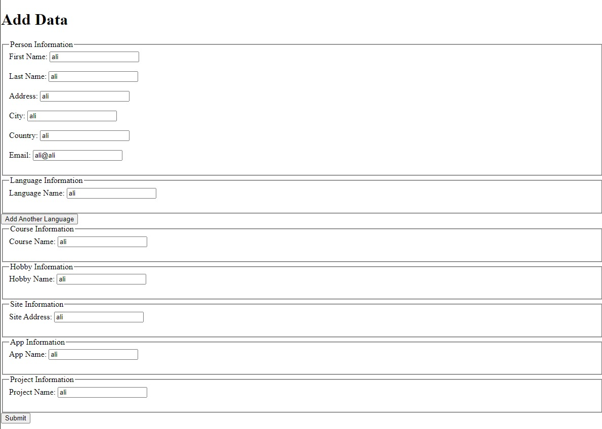
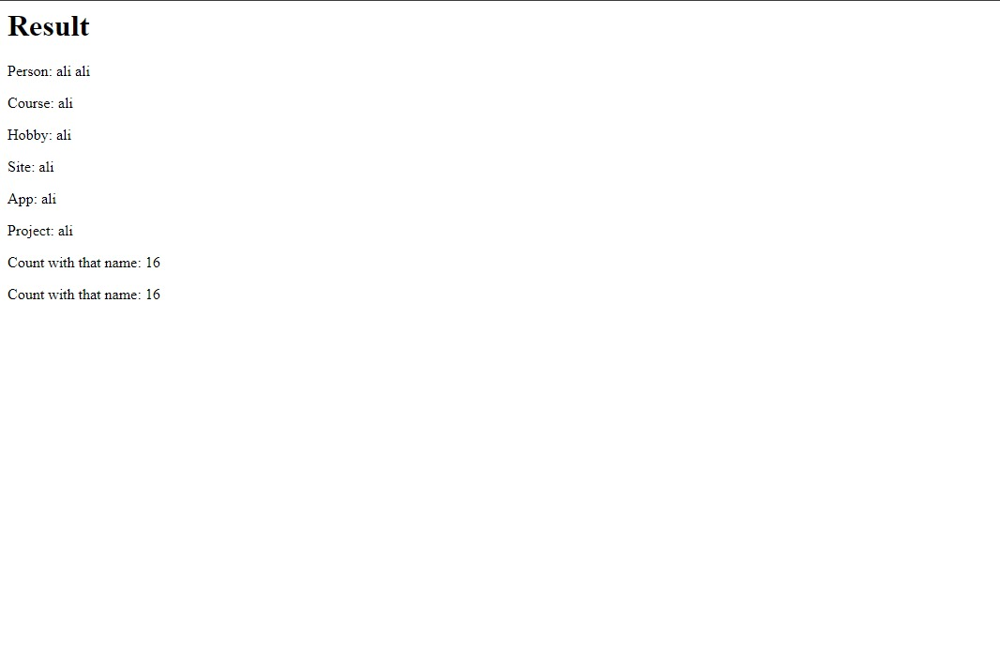

# My CV Project

This project is a web application for managing personal information, languages, courses, hobbies, sites, apps, and projects related to a CV (curriculum vitae).

## Technologies Used

- Node.js
- Express.js
- SQLite3
- HTML
- CSS 

## Getting Started

To get started with this project, follow these steps:

1. Clone the repository:

   ```bash
   git clone https://github.com/MohamedHamed12/CRUD_LAB.git
   ```

2. Navigate to the project directory:

   ```bash
   cd CRUD_LAB
   ```

3. Install dependencies:

   ```bash
   npm install
   ```

4. Start the server:

   ```bash
   npm start
   ```

5. Access the application in your web browser at `http://localhost:3000`.

## Usage

- Fill out the form to add personal information, languages, courses, hobbies, sites, apps, and projects to your CV.
- The data will be stored in a SQLite database (`mycvproject.sqlite`).

## Folder Structure

```
src/
│
├── controllers/
│   └── homeController.js
│   └── appController.js
│   └── siteController.js
│   └── courseController.js
│   └── projectController.js
│   └── languageController.js
│   └── hobbyController.js
│
├── db/
│   └── db.js
|   └── schema.sql
│
├── models/
│   └── personModel.js
│   └── languageModel.js
│   └── courseModel.js
│   └── hobbyModel.js
│   └── siteModel.js
│   └── appModel.js
│   └── projectModel.js
│
├── routes/
│   └── personRoutes.js
│   └── languageRoutes.js
│   └── courseRoutes.js
│   └── hobbyRoutes.js
│   └── siteRoutes.js
│   └── appRoutes.js
│   └── projectRoutes.js
│
├── templates/
│   └── home.ejs
│
│
├── index.js
└── README.md
```

## Contributing

Contributions are welcome! Please submit a pull request with your changes.

## License

This project is licensed under the MIT License - see the [LICENSE](LICENSE) file for details.


